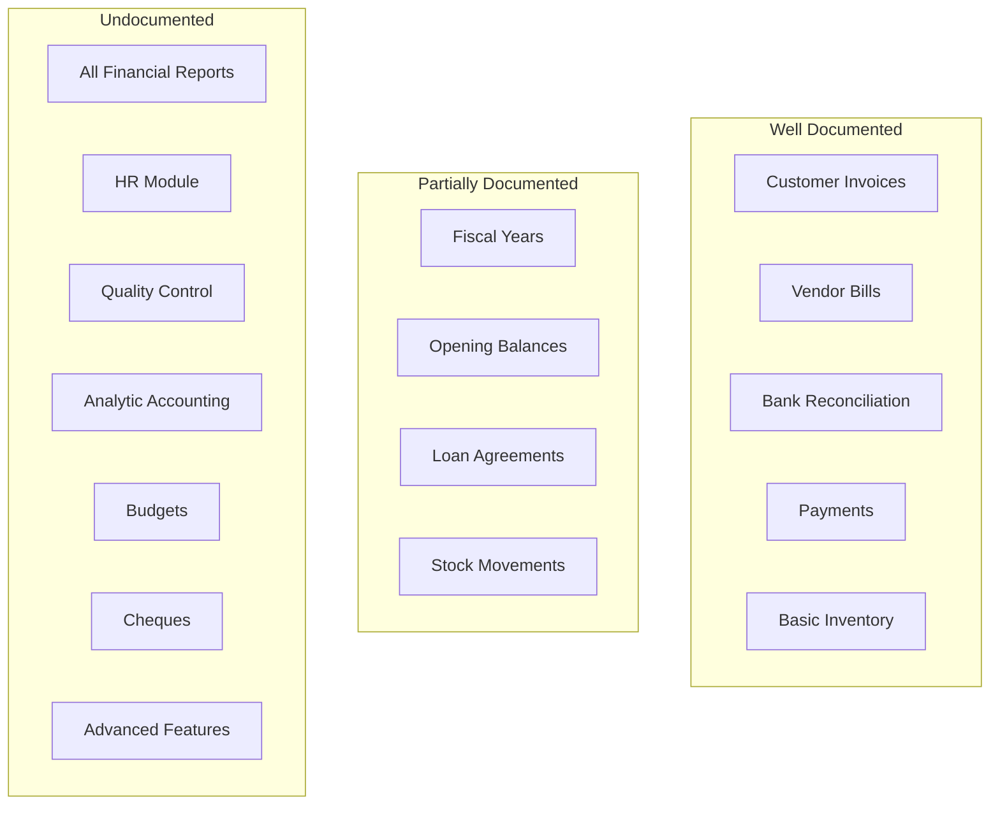

# Documentation Gaps Report

**Generated:** 2026-01-15  
**Analysis Scope:** Full codebase review including all 11 modules, skills, developer docs, and user guides

---

## Executive Summary

This report identifies gaps between the implemented features in the JMeryar ERP codebase and existing documentation. The analysis covers:

- **11 Modules** with 2,219+ files
- **5 Skill Documents** (agent configuration)
- **14 Developer Guides**
- **50 User Guides** (with multi-language support)
- **1 Documentation Standard**

### Key Findings

| Category | Status | Notes |
|----------|--------|-------|
| User Guides | 🟡 Partial | Good coverage for core features, significant gaps in advanced features |
| Developer Docs | 🟡 Partial | Architecture documented, module-specific guides lacking |
| Skill Documents | 🟢 Good | Recently updated, reflect current codebase |
| README | 🟢 Good | Comprehensive architectural overview |
| API Documentation | 🔴 Missing | No REST/HTTP controller documentation |

---

## 1. User Guide Documentation Gaps

### 1.1 Accounting Module — Missing Guides

#### 🔴 Critical (No Documentation)

| Feature | Filament Resource | Priority |
|---------|------------------|----------|
| **Account Groups** | `AccountGroupResource` | High |
| **Analytic Accounts** | `AnalyticAccountResource` | High |
| **Analytic Plans** | `AnalyticPlanResource` | High |
| **Budgets & Budget Control** | `BudgetResource` | High |
| **Cheque Management** | `ChequeResource` | High |
| **Currency Revaluation** | `CurrencyRevaluationResource` | Medium |
| **Deferred Revenue/Expenses** | `DeferredItemResource` | Medium |
| **Dunning Levels** | `DunningLevelResource` | Medium |
| **Recurring Templates** | `RecurringTemplateResource` | Medium |
| **Audit Logs** | `AuditLogResource` | Low |
| **Lock Dates** | `LockDateResource` | Medium |
| **Adjustment Documents** | `AdjustmentDocumentResource` | High |

#### 🟡 Partial Coverage

| Feature | Existing Doc | Missing Content |
|---------|--------------|-----------------|
| **Assets** | `docs/Developers/asset_analysis_report.md` | User-facing guide missing |
| **Journal Entries** | `docs/Developers/journal_entry_flow_report.md` | User-facing guide missing |
| **Tax Management** | Mentioned in architecture | Comprehensive user guide missing |
| **Fiscal Positions** | Concept mentioned | User guide on configuration missing |

---

### 1.2 Accounting Reports — Undocumented

The `Modules/Accounting/app/Filament/Clusters/Accounting/Pages/Reports/` directory contains 11 report pages. **None have dedicated user guides:**

| Report | File | Documentation Status |
|--------|------|---------------------|
| Trial Balance | `ViewTrialBalance.php` | 🟢 Completed |
| Balance Sheet | `ViewBalanceSheet.php` | 🟢 Completed |
| Profit & Loss (P&L) | `ViewProfitAndLoss.php` | 🟢 Completed |
| Cash Flow Statement | `ViewCashFlowStatement.php` | 🟢 Completed |
| General Ledger | `ViewGeneralLedger.php` | 🟢 Completed |
| Aged Receivables | `ViewAgedReceivables.php` | 🟢 Completed |
| Aged Payables | `ViewAgedPayables.php` | 🔴 Missing |
| Partner Ledger | `ViewPartnerLedger.php` | 🔴 Missing |
| Tax Report | `ViewTaxReport.php` | 🔴 Missing |
| Analytic Report | `ViewAnalyticReport.php` | 🔴 Missing |
| Currency Gain/Loss Report | Unknown | 🔴 Missing |

> [!IMPORTANT]
> Financial reports are critical for end-users. Each report needs: explanation of data shown, filters available, interpretation guidance, and export options.

---

### 1.3 Inventory Module — Gaps

#### 🔴 Missing User Guides

| Feature | Notes |
|---------|-------|
| **Valuation Methods (FIFO/AVCO)** | Complex feature, no dedicated guide |
| **Landed Costs** | No documentation |
| **Scrap/Disposal Management** | Implemented but undocumented |
| **Multi-Warehouse Transfers** | Only `inter-warehouse-transfers.md` exists, needs expansion |
| **Inventory Adjustments** | No dedicated guide |
| **Stock Valuation Reports** | No documentation |

#### 🟡 Existing But Incomplete

| Document | Missing Content |
|----------|-----------------|
| `stock-management.md` | Missing: warehouse configuration, location types, stock rules |
| `stock-movements.md` | Missing: different move types, validation workflow |
| `lot-tracking.md` | Missing: expiry handling, lot reservation |
| `serial-number-tracking.md` | Thin content, needs expansion |

---

### 1.4 HR Module — Significant Gaps

The HR module has 12 models and 51+ Filament components but minimal user documentation:

| Feature | Documentation Status |
|---------|---------------------|
| **Employee Management** | 🔴 Missing |
| **Department/Job Position Configuration** | 🔴 Missing |
| **Leave Management** | 🔴 Missing |
| **Payroll Processing** | 🔴 Missing |
| **Salary Structures** | 🔴 Missing |
| **Attendance Tracking** | 🔴 Missing |
| **Expense Reports** | 🔴 Missing |
| **Work Contracts** | 🔴 Missing |
| Cash Advances | 🟢 `understanding-cash-advances.md` |
| Petty Cash | 🟢 `understanding-petty-cash.md` |

---

### 1.5 Payment Module — Gaps

| Feature | Documentation Status |
|---------|---------------------|
| Payment Allocation Logic | 🟡 Partial in `payments.md` |
| Partial Payments | 🔴 Missing details |
| Payment Reversal/Cancellation | 🔴 Missing |
| Multi-Currency Payments | 🟡 Mentioned but not detailed |
| Overpayment Handling | 🔴 Missing |
| Prepayment Scenarios | 🔴 Missing |

---

### 1.6 Sales & Purchase Modules — Gaps

#### Sales Module

| Feature | Documentation Status |
|---------|---------------------|
| Customer Invoices | 🟢 `customer-invoices.md` (multi-language) |
| Credit Notes | 🔴 Missing dedicated guide |
| Sales Quotes | 🔴 Missing |
| Dunning Process | 🔴 Missing (despite `DunningLevelResource`) |
| Revenue Recognition | 🔴 Missing |

#### Purchase Module

| Feature | Documentation Status |
|---------|---------------------|
| Vendor Bills | 🟢 `vendor-bills.md` (multi-language) |
| Debit Notes | 🔴 Missing |
| Purchase Orders | 🟡 Partial |
| Vendor Management | 🔴 Missing |
| 3-Way Matching | 🔴 Missing |

---

### 1.7 Manufacturing Module — Nearly Undocumented

The Manufacturing module has 77 files including 6 models, 7 actions, and 18 Filament components:

| Feature | Documentation Status |
|---------|---------------------|
| Bill of Materials | 🟢 `bill-of-materials.md` |
| Manufacturing Orders | 🟢 `manufacturing-orders.md` |
| Work Centers | 🔴 Missing |
| Work Orders | 🔴 Missing |
| Production Planning | 🔴 Missing |
| Component Consumption | 🔴 Missing |
| Finished Goods Receipt | 🔴 Missing |

---

### 1.8 Quality Control Module — Undocumented

The QualityControl module has 99 files but **zero user guides**:

| Feature | Notes |
|---------|-------|
| Quality Checks | Implemented with `QualityCheckResource` |
| Quality Alerts | Implemented with `QualityAlertResource` |
| Quality Points | Configuration feature |
| Quality Teams | Organization feature |

---

### 1.9 Project Management Module — Gaps

| Feature | Documentation Status |
|---------|---------------------|
| Projects | 🟢 `project-management.md` |
| Project Budgeting | 🟢 `project-budgeting.md` |
| Timesheets | 🟢 `timesheet-tracking.md` |
| Project Tasks | 🔴 Missing dedicated guide |
| Project Invoicing | 🔴 Missing |
| Analytic Integration | 🔴 Missing |

---

## 2. Developer Documentation Gaps

### 2.1 Missing Module-Specific Architecture Docs

Each module should have a dedicated architecture document explaining:
- Module purpose and scope
- Key models and relationships
- Service classes and their responsibilities
- Event-driven workflows
- Cross-module dependencies

| Module | Architecture Doc Status |
|--------|------------------------|
| Accounting | 🟡 Partial (in skills + README) |
| Foundation | 🔴 Missing |
| Sales | 🔴 Missing |
| Purchase | 🔴 Missing |
| Inventory | 🟡 `inventory-movements-guide.md` exists |
| HR | 🔴 Missing |
| Payment | 🔴 Missing |
| Product | 🔴 Missing |
| ProjectManagement | 🟢 `project-management-architecture.md` |
| Manufacturing | 🔴 Missing |
| QualityControl | 🔴 Missing |

---

### 2.2 Missing Developer Guides

| Topic | Status |
|-------|--------|
| **Multi-Tenancy Architecture** | 🔴 Missing (company_id scoping patterns) |
| **Currency Handling Guide** | 🔴 Missing (Brick\Money patterns, conversions) |
| **Event & Listener Reference** | 🔴 Missing (listing all domain events) |
| **Testing Patterns Guide** | 🟡 `filament_testing.md` exists, needs expansion |
| **DTO Creation Guide** | 🔴 Missing |
| **Action Development Guide** | 🔴 Missing |
| **Observer Patterns Guide** | 🔴 Missing |
| **Plugin Development** | 🔴 Missing (tax plugins, extensions) |
| **Database Schema Reference** | 🔴 Missing |
| **API Reference** | 🔴 Missing (if HTTP controllers exist) |

---

### 2.3 Existing Developer Docs — Assessment

| Document | Quality | Notes |
|----------|---------|-------|
| `complete-technical-documentation.md` | 🟢 Good | May need updates |
| `journal_entry_flow_report.md` | 🟢 Good | Core accounting well-documented |
| `inventory-movements-guide.md` | 🟢 Good | Comprehensive |
| `inventory-system-production-readiness-report.md` | 🟢 Good | Status report format |
| `project-management-architecture.md` | 🟢 Good | Good architecture doc example |
| `partner-financial-overview.md` | 🟢 Good | |
| `asset_analysis_report.md` | 🟡 Partial | Needs user guide companion |
| `invoice_number_race_condition_fix.md` | 🟢 Good | Implementation detail |
| `filament-enum-usage-examples.md` | 🟢 Good | Pattern reference |
| `tax-reporting-plugins.md` | 🟡 Partial | Plugin architecture needs expansion |
| `number-formatting.md` | 🟢 Good | |
| `financial-dashboard-implementation.md` | 🟢 Good | |
| `write_off_feature_plan.md` | 🟡 Partial | Plan document, may be outdated |

---

## 3. Skill Documents — Assessment

| Skill | Status | Gaps Identified |
|-------|--------|-----------------|
| `jmeryar-overview` | 🟢 Good | None significant |
| `jmeryar-architecture` | 🟢 Good | Could add more service examples |
| `jmeryar-coding-style` | 🟢 Good | Recently updated |
| `laravel-boost` | 🟢 Good | Framework-focused |
| `browser-testing` | 🟢 Good | Could add more test patterns |

---

## 4. Translation Coverage Gaps

The documentation has multi-language support for some features but not consistently:

| Document | EN | CKB | AR |
|----------|:--:|:---:|:--:|
| bank-reconciliation | ✅ | ✅ | ✅ |
| bank-statements | ✅ | ✅ | ✅ |
| customer-invoices | ✅ | ✅ | ✅ |
| vendor-bills | ✅ | ✅ | ✅ |
| payments | ✅ | ✅ | ✅ |
| stock-management | ✅ | ✅ | ✅ |
| loan-agreements | ✅ | ✅ | ✅ |
| opening-balances | ✅ | ✅ | ✅ |
| payment-terms-guide | ✅ | ✅ | ✅ |
| fiscal-years | ✅ | ✅ | ❌ |
| inventory-ins-and-outs | ✅ | ✅ | ❌ |
| stock-picking | ✅ | ✅ | ❌ |
| getting-started | ✅ | ❌ | ❌ |
| project-management | ✅ | ❌ | ❌ |
| All other docs | ✅ | ❌ | ❌ |

---

## 5. Recommended Priorities

### 🔴 High Priority (Critical Gaps)

1. **Financial Reports User Guides** — Users need to understand all 11 reports
2. **HR Module Guides** — Large module with zero documentation
3. **Quality Control Guides** — Entire module undocumented
4. **Accounting Reports Interpretation Guide** — How to read and use each report
5. **Cheque Management** — Common workflow, undocumented

### 🟡 Medium Priority

6. **Analytic Accounting Guide** — Complex feature for cost allocation
7. **Budget Management** — Important for financial planning
8. **Credit Notes & Debit Notes** — Common adjustments, no guides
9. **Module Architecture Docs** — Foundation, HR, Payment, Manufacturing
10. **Multi-Currency Deep Dive** — Exchange rates, revaluation, gain/loss

### 🟢 Lower Priority (Nice to Have)

11. **Recurring Templates** — Automation feature
12. **Audit Log Usage** — For compliance-focused users
13. **Work Center & Work Order Guides** — Manufacturing detail
14. **Translation Backfill** — Complete CKB/AR coverage

---

## 6. Summary Statistics

| Metric | Count |
|--------|-------|
| Total Modules | 11 |
| Filament Resources (Accounting alone) | 32 |
| Existing User Guides | 50 |
| Missing User Guides (estimated) | 35+ |
| Existing Developer Docs | 14 |
| Missing Developer Docs (estimated) | 15+ |
| Multilingual Docs (complete) | 10 |
| Multilingual Docs (partial/missing) | 40+ |

---

## 7. Documentation Debt Visualization

---

## Next Steps

1. **Prioritize** high-impact user guides (reports, HR)
2. **Template** new docs using `DOCUMENTATION_STANDARD.md`
3. **Assign** ownership for each missing guide
4. **Track** documentation alongside feature development
5. **Automate** translation workflow for new content

---

*This report should be reviewed quarterly and updated as documentation is added.*
