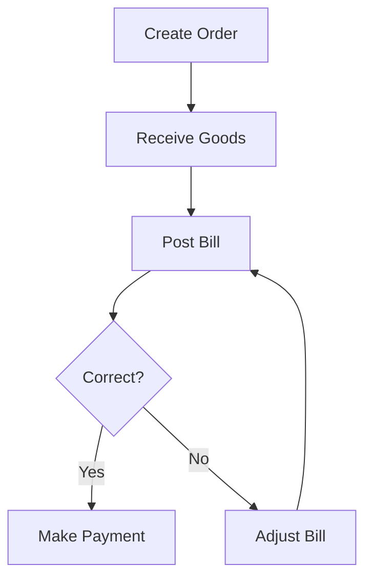

# Writing Great User Guides: Your Friendly Style Guide

This guide shows you how to write documentation that **anyone** can understand—whether they're an accountant, a business owner, or someone who's never touched an accounting app before. Think of it as your recipe book for creating helpful, easy-to-read guides.

---

## Why Good Documentation Matters

Ever tried assembling IKEA furniture without instructions? That's how users feel with bad documentation.

**Great documentation should:**
- 🎯 Be easy to find what you need
- 💬 Use plain language (no jargon soup)
- 📖 Include real examples (not abstract theory)
- 🧭 Guide users step-by-step
- ❓ Answer the questions users actually ask

> **💡 Golden Rule**: Write like you're explaining something to a smart friend who happens to know nothing about accounting software.

---

## Document Structure: The Building Blocks

Every user guide follows a similar pattern. Think of it like a house—you need a foundation, walls, and a roof.

### 0. 📂 File Naming & Location

Before you write a word, make sure your file is named correctly:

- **English Rules**: Use `kebab-case.md` for English files (e.g., `trial-balance-report.md`).
- **Translation Rules**: Use `filename.lang-code.md` for translations.
  - Kurdish: `trial-balance-report.ckb.md`
  - Arabic: `trial-balance-report.ar.md`
- **Location**: Keep translations **in the same folder** as the original. Don't create language subfolders!

---

### 1. 📋 Start with the Basics (Frontmatter)

At the very top of every document, include this metadata:

```yaml
---
title: Your Feature Name
icon: heroicon-o-book-open  # Optional - pick an icon that fits
order: 5                     # Optional - controls menu order
---
```

**Why?** This helps the system organize your docs and show nice icons in the navigation.

---

### 2. 📌 The Header: Set the Stage

Start every guide with a welcoming introduction:

```markdown
# [Feature Name]: A Friendly Subtitle

This guide explains how [feature] works in plain language. Whether you're 
an accountant or just trying to figure things out, we've got you covered.

---
```

**What makes a good intro?**

| Do This ✅ | Not This ❌ |
|-----------|-------------|
| "This guide explains how invoices work" | "This document provides comprehensive documentation for the invoice subsystem" |
| "We'll walk you through..." | "The following sections will enumerate..." |
| "Whether you're new or experienced..." | "For users with varying levels of expertise..." |

---

### 3. 🤔 "What Is This?" Section

Always start by answering the basic question: what even IS this feature?

**Example:**
```markdown
## What is [Feature Name]?

Think of [feature] like [everyday analogy]. When you [common scenario], 
the system [what it does].

**Why does this matter?**
1. **Reason 1**: Why users should care
2. **Reason 2**: What problem it solves
3. **Reason 3**: How it helps the business
```

**Real Example:**
> Think of a vendor bill like a restaurant receipt—but for your business. 
> When your supplier sends you a bill for goods you ordered, you record it 
> here so you remember to pay them (and your accountant knows what you owe).

---

### 4. 📍 "Where Do I Find This?" Section

Tell users exactly how to get there:

```markdown
## Where to Find It

Navigate to: **Accounting → Vendor Bills → Create New**

You'll also see vendor bills in:
- **Dashboard**: Quick access to recent bills
- **Vendor profile**: All bills for that supplier

> **💡 Tip**: Look for the Help button in the top-right corner—it opens this guide!
```

**Formatting rules:**
- Use **bold** for menu items and buttons
- Use → arrows between menu levels
- Include related places where the feature appears

---

### 5. 📝 Step-by-Step Instructions

This is the meat of your guide. Break it down into numbered steps:

```markdown
## Creating a [Thing]

Let's walk through creating a new [thing] step by step.

### Step 1: Start Fresh

Navigate to **Menu → Create New**

You'll see a form with these fields:

| Field | What to Enter | Example |
|-------|---------------|---------|
| **Name** | Give it a descriptive name | "Office Supplies - January" |
| **Date** | When this happened | Today's date (auto-filled) |
| **Amount** | The total value | 150.00 |

### Step 2: Add the Details

Now fill in the specifics...

### Step 3: Review and Save

Before clicking **Save**, double-check:
- [ ] Is the date correct?
- [ ] Do the amounts match your receipt?
- [ ] Did you pick the right category?

Click **Save** and you're done! 🎉
```

---

## Making Accounting Make Sense

### 🏦 Showing Journal Entries

When you need to explain the accounting impact, make it visual:

```markdown
## What Happens Behind the Scenes

When you post this transaction, the system creates this journal entry:

┌─────────────────────────────────────────────────────────────┐
│  Dr. Office Supplies Expense        $150.00                 │
│      Cr. Accounts Payable                    $150.00        │
└─────────────────────────────────────────────────────────────┘

**In plain English**: We're recording that we spent $150 on office 
supplies, and we now owe our supplier that amount.
```

**Key tips:**
- Always include the "In plain English" translation
- Use consistent formatting (Dr. for debits, Cr. for credits)
- Show example amounts to make it concrete

---

### 📊 Status Workflows

If your feature has different states (Draft → Posted → Paid), visualize it:

```markdown
## Understanding Statuses

Your invoice goes through these stages:

┌─────────┐      ┌─────────┐      ┌─────────┐
│  Draft  │ ──▶ │ Posted  │ ──▶ │  Paid   │
└─────────┘      └─────────┘      └─────────┘
    📝              ✅              💰

### 📝 Draft
- You can still edit everything
- Nothing is recorded in the books yet
- Safe to delete if you change your mind

### ✅ Posted  
- Locked for editing (keeps your books accurate)
- Appears in reports and financial statements
- Can be cancelled, but not deleted

### 💰 Paid
- Payment has been recorded
- All done! 🎉
```

---

## Writing Real Examples

### 🎬 Scenario-Based Examples

Don't just describe—show! Create realistic business scenarios:

```markdown
## Common Scenarios

### Scenario 1: Buying Office Supplies

**The situation**: You bought $250 worth of printer paper and pens from 
Office Depot. They gave you a bill with Net 30 payment terms.

**Here's what you do:**

1. Go to **Accounting → Vendor Bills → Create New**
2. Fill in the details:
   - **Vendor**: Office Depot
   - **Bill Date**: March 15
   - **Due Date**: April 14 (30 days later)
   - **Amount**: $250.00
3. Add a line for "Office Supplies"
4. Click **Post**

**What happens:**
- ✅ Your accounts payable increases by $250
- ✅ This bill appears in your "Bills to Pay" report
- ✅ On April 14, you'll get a reminder to pay

### Scenario 2: Dealing with Multiple Currencies

**The situation**: You bought parts from a UK supplier for £500...
```

---

## Making Content Scannable

### 📋 Tables for Quick Reference

Use tables when comparing options or listing field descriptions:

```markdown
| Method | Best For | Trade-off |
|--------|----------|-----------|
| **FIFO** | Perishable goods | More record-keeping |
| **AVCO** | Stable prices | Less precise |
| **LIFO** | Tax savings | Not IFRS-compliant |
```

### 📣 Callout Boxes

Use GitHub-style alerts to highlight important info:

> [!NOTE]
> Extra context that's helpful but not critical.

> [!TIP]
> A clever shortcut or best practice.

> [!IMPORTANT]
> Something users really need to know.

> [!WARNING]
> Could cause problems if ignored.

> [!CAUTION]
> This action can't be undone!

**When to use each:**

| Alert Type | Use When... |
|------------|-------------|
| NOTE | Providing extra context or background |
| TIP | Sharing helpful shortcuts or best practices |
| IMPORTANT | Highlighting must-know information |
| WARNING | Something could go wrong |
| CAUTION | Destructive or irreversible action |

---

### 🎨 Visual Diagrams

For complex flows, use ASCII art or Mermaid diagrams:

**ASCII Art (simple flows):**
```
Purchase Order ──▶ Vendor Bill ──▶ Payment
     📋               📄            💳
```

**Mermaid (complex relationships):**


---

## Best Practices Section

Every guide should end with practical advice:

```markdown
## Best Practices

### 📅 Timing
- **Record transactions daily**: Don't let them pile up
- **Reconcile weekly**: Catch errors early
- **Review monthly**: Stay on top of trends

### ✅ Accuracy
- **Double-check amounts**: Typos are expensive
- **Match to source documents**: Keep receipts organized  
- **Use the right accounts**: When in doubt, ask

### 🔒 Security
- **Limit who can post**: Reduce mistake risk
- **Review before month-end**: Harder to fix later
- **Keep audit trails**: Your future self will thank you
```

---

## Troubleshooting: Help Users Help Themselves

A good troubleshooting section prevents support tickets:

```markdown
## Troubleshooting

### Common Questions

**Q: Why can't I edit this invoice?**

A: Once an invoice is **Posted**, it's locked for editing. This protects 
your financial records. Here's what you can do:
- Create a **credit note** to reverse it
- Contact your admin to **unpost** it (if policy allows)

**Q: The totals don't match—what happened?**

A: Check these common causes:
1. **Rounding differences**: Currency conversions can cause tiny differences
2. **Tax calculations**: Make sure the right tax rate is applied
3. **Multiple lines**: Did you enter all the items?

> **💡 Still stuck?** Contact support with your document number—we're here to help!

### Error Messages

**"Cannot post: Unbalanced entry"**

This means your debits don't equal your credits. Double-check:
- Are all line items entered correctly?
- Is a required account missing?
- Did auto-calculation work properly?
```

---

## FAQ Section

Gather the questions users actually ask:

```markdown
## Frequently Asked Questions

**Q: Can I import data from Excel?**

A: Yes! Go to **Settings → Import** and upload your file. We support 
.xlsx and .csv formats. [See the Import Guide](import-guide.md) for 
column mapping details.

**Q: What's the difference between posting and saving?**

A: Think of it this way:
- **Save as Draft**: Like saving a Word doc—you can still edit
- **Post**: Like hitting "Send" on an email—it's official now

**Q: Can I delete old transactions?**

A: Posted transactions can't be deleted (for audit purposes), but 
you can:
- Archive them so they don't clutter your view
- Create reversing entries to cancel their effect
```

---

## Wrapping Up: Related Docs & Glossary

End with links to related topics and a glossary if needed:

```markdown
## Related Documentation

- [Getting Started Guide](getting-started.md) - New here? Start with this
- [Vendor Management](vendor-management.md) - Setting up suppliers
- [Payment Processing](payments.md) - How to pay your bills

---

## Glossary

- **COGS**: Cost of Goods Sold—what you paid for items you sold
- **Posting**: Making a transaction official in the books
- **Reconciliation**: Matching your records to bank statements
- **Accrual**: Recording income/expenses when earned, not when cash moves
```

---

## Quality Checklist

Before you publish, run through this checklist:

### ✍️ Writing Quality
- [ ] Would a non-accountant understand this?
- [ ] Did I avoid jargon (or explain it when used)?
- [ ] Are steps numbered and clear?
- [ ] Do examples use realistic scenarios?

### 🎨 Formatting
- [ ] Is the structure consistent with other guides?
- [ ] Are menu paths in **bold** with → arrows?
- [ ] Did I use tables for comparisons?
- [ ] Are callout boxes used appropriately?

### 📚 Content
- [ ] Does it start with "What is..."?
- [ ] Are navigation instructions included?
- [ ] Is there a troubleshooting section?
- [ ] Are related docs linked at the end?

### 🔍 Accuracy  
- [ ] Did I test the steps myself?
- [ ] Are menu paths current?
- [ ] Do screenshots match the current UI?
- [ ] Are accounting explanations correct?

---

## A Final Word

Remember: **great documentation is an act of empathy**. 

When you write, imagine someone who:
- Is smart but new to this software
- Is a bit stressed because they need to get work done
- Doesn't have time to read a novel

Write for them. Use plain language. Include examples. Make it scannable.

Your users will thank you! 🙏

---

## Quick Reference: Markdown Formatting

| Element | Syntax | When to Use |
|---------|--------|-------------|
| **Bold** | `**text**` | Field names, buttons, important terms |
| *Italics* | `*text*` | Emphasis, notes |
| `Code` | `` `text` `` | Exact UI text, file names |
| [Links](url) | `[text](url)` | Cross-references |
| > Quotes | `> text` | Examples, quotes |
| Tables | `\| col \|` | Comparisons, field lists |
| Lists | `- item` or `1. item` | Steps, features |
| Headers | `## Title` | Section organization |

---

*Happy documenting! 📝*
