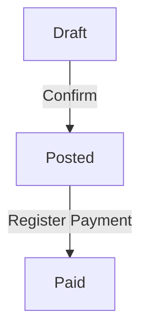

# User Guide Documentation Standard

This document establishes the comprehensive standard for creating consistent, high-quality user guides across our accounting system documentation. Based on analysis of existing user guides, this standard ensures uniformity, completeness, and usability for all documentation.

---

## Document Structure Template

### 1. Metadata (Frontmatter)
Start every document with YAML frontmatter:
```yaml
---
title: [Feature Name]
icon: [Heroicon Name] # Optional, e.g. heroicon-o-book-open
order: [Sort Order] # Optional integer
---
```

### 2. Document Header
```markdown
# [Feature Name]: [Brief Descriptive Subtitle]

This [comprehensive/detailed] guide explains how [feature name] work[s] in [the/your] [system/accounting system], covering [main topics]. Written for all users — accountants and non‑accountants — it provides practical guidance following [double‑entry] accounting best practices.

---
```

**Requirements:**
- Use the feature name as the main title
- Include a descriptive subtitle that explains the purpose
- Lead with a clear introductory paragraph
- Always mention the target audience (accountants and non-accountants)
- Reference accounting best practices where applicable
- Use three dashes (---) as section separators

### 3. Core Content Sections (Required)

#### A. What is [Feature Name]? Section
```markdown
## What is [Feature Name]?

[Feature description paragraph explaining the concept]

[Optional: List of key characteristics with bullet points]
- **Key Point 1**: Description
- **Key Point 2**: Description

**[Accounting Impact/Purpose/Principle]**: [Explanation of accounting implications or core principle]
```

**Requirements:**
- Always start with "What is..." question format
- Provide clear, non-technical explanation
- Include accounting impact or principle where relevant
- Use bold formatting for key terms and concepts

#### B. System Requirements/Prerequisites (When Applicable)
```markdown
## System Requirements

### [Category Name]
- **Setting Name**: Description and requirement
- **Permission Level**: Required access level
- **Configuration**: Setup requirements

### Prerequisites
1. **Requirement 1**: [Description]
2. **Requirement 2**: [Description]
```

#### C. Navigation Information
```markdown
## Where to find it in the UI

Navigate to **[Menu Path]** through: **[Section] → [Subsection] → [Feature]**

[Feature name] also appear[s] in:
- **[Related Location 1]**: [Context/Action available]
- **[Related Location 2]**: [Context/Action available]

Tip: The header's Help/Docs button opens this guide.
```

**Requirements:**
- Use bold formatting for menu paths
- Use → (arrow) to separate menu levels
- Include related locations where feature appears
- Always mention the Help/Docs button when available

#### D. Core Functionality Sections
Follow step-by-step format:

```markdown
## [Main Process Name]

Navigate to **[Full Menu Path]**

### Step 1: [Action Name]

**Field Name**: [Description and guidance]
**Another Field**: [Description and guidance]

### Step 2: [Next Action]

[Detailed instructions with field explanations]

### Step 3: [Final Action]

[Completion instructions]
```

### 4. Advanced Features (When Applicable)

#### A. Multi-Currency Handling
```markdown
## Multi-Currency [Feature]

### [Currency Feature Name]
- **[Currency Field]**: [Description]
- **Exchange Rate**: [How rates are handled]
- **Conversion**: [Automatic conversion description]

### Exchange Rate Management
[Details about rate locking, capture, etc.]

**Example**: [Concrete example with currencies and amounts]
- [Step 1]: Amount in [currency] at rate [rate]
- [Step 2]: Conversion details
- [Result]: Final accounting impact
```

#### B. Status Workflow
```markdown
## [Feature] Status Workflow

### [Status 1]
- [Description of status]
- [What can be done in this status]
- [Accounting impact or lack thereof]

### [Status 2]
- [Description and capabilities]
- [Restrictions and implications]

**Important**: [Key restriction or workflow rule]
```

### 5. Accounting Impact (Required for Financial Features)

```markdown
## Journal Entry Impact

### [Transaction Type 1]
```
Dr. [Account Name]         $[Amount]
    Cr. [Account Name]           $[Amount]
```

### [Transaction Type 2]
```
Dr. [Account Name]         $[Amount]
Dr. [Account Name]         $[Amount]
    Cr. [Account Name]           $[Amount]
```

[Additional explanation of journal entry logic]
```

**Requirements:**
- Use proper journal entry format with Dr./Cr.
- Show actual account names where possible
- Include dollar amounts or variables
- Explain the accounting logic behind entries

### 6. Examples Section (Required for Complex Features)

```markdown
## Common Scenarios

### Scenario 1: [Scenario Name]
[Brief description of the business case]

**Steps:**
1. [Action 1 with specific details]
2. [Action 2 with specific values]
3. [Action 3 with results]

**Result:**
- [Outcome 1]
- [Outcome 2]

### Scenario 2: [Another Scenario]
[Different business case with specific examples]

**Example**: [Concrete example with real values]
- [Specific data point 1]: [Value/Setting]
- [Specific data point 2]: [Value/Setting]
- [Result]: [What happens]
```

### 7. Best Practices Section (Required)

```markdown
## Best Practices

### [Category 1]
- **[Practice Name]**: [Description and rationale]
- **[Another Practice]**: [Description and benefit]

### [Category 2]
- **[Practice Name]**: [Description and implementation]
- **[Another Practice]**: [Description and impact]

### [Category 3] (When Applicable)
- **[Practice Name]**: [Description]

### Audit and Compliance (When Applicable)
- **[Compliance Practice]**: [Description and requirement]
- **[Documentation Practice]**: [Description and benefit]
```

### 8. Troubleshooting Section (Required)

```markdown
## Troubleshooting

### Common Issues

**Q: [Question/Problem statement]**
A: [Answer/Solution]
- [Specific step or check]
- [Alternative solution]
- [When to contact support]

**Q: [Another common question]**
A: [Detailed solution with steps]

### Error Messages (When Applicable)

**"[Exact error message]"**
- [Cause explanation]
- [Solution steps]

**"[Another error message]"**
- [Cause and resolution]
```

### 9. FAQ Section (Optional but Recommended)

```markdown
## Frequently Asked Questions

**Q: [Question]**
A: [Answer with explanation]

**Q: [Complex question]**
A: [Detailed answer with examples or steps]

**Q: [Business process question]**
A: [Answer with business context]
```

### 10. Glossary Section (Recommended for Complex Features)

```markdown
## Glossary

- **[Term 1]**: [Definition in context of the feature]
- **[Term 2]**: [Clear definition with business meaning]
- **[Technical Term]**: [User-friendly explanation]
- **[Accounting Term]**: [Definition with accounting context]
```

### 11. Related Documentation (Required)

```markdown
## Related Documentation

- [Guide Name](filename.md) - [Brief description of relevance]
- [Another Guide](filename.md) - [How it relates to current topic]

---

[Optional closing statement about the feature's importance or role]
```

---

## Formatting Standards

### 1. Typography

#### Headers
- **H1**: Main document title only
- **H2**: Major sections (What is, Creating, Best Practices, etc.)
- **H3**: Sub-sections and process steps
- **H4**: Field names and detailed sub-topics

#### Text Emphasis
- **Bold**: Field names, important concepts, menu items, buttons
- *Italics*: Emphasis within sentences, notes
- `Code formatting`: Exact text from UI, file names, technical terms
- **Navigation paths**: Use bold for entire path with → separators

#### Lists
- Use bullet points for features, benefits, characteristics
- Use numbered lists for sequential steps
- Use dashes for simple lists
- Maintain parallel structure in list items

### 2. Code and Examples

#### Journal Entries
```
Dr. Account Name          $X,XXX
Dr. Another Account       $X,XXX
    Cr. Account Name           $X,XXX
    Cr. Another Account        $X,XXX
```

#### UI Navigation
- **Menu → Submenu → Feature**
- Navigate to **Section → Subsection**
- Click **Button Name**

#### Code Blocks
Use triple backticks for:
- Terminal commands
- Configuration examples
- Multi-line code samples

### 3. Cross-References

#### Internal Links
- `[Feature Name](filename.md)` for other user guides
- `[Section Name](#section-anchor)` for same-document links
- Always use descriptive link text, not "click here"

#### External References
- Link to relevant external documentation when needed
- Provide context for why external link is relevant

### 4. Tables

#### Field Description Tables
| Field | Description | Required | Example |
|-------|-------------|----------|---------|
| Field Name | What it does | Yes/No | Sample value |

#### Comparison Tables
| Feature | Option 1 | Option 2 | Recommendation |
|---------|----------|----------|----------------|
| Aspect | Description | Description | When to use |

### 5. Visual Elements

#### Alerts (GFM)
Use GitHub Flavored Markdown alerts for emphasis.

> [!NOTE]
> Useful information that users should know, even when skimming.

> [!TIP]
> Helpful advice for doing things better or faster.

> [!IMPORTANT]
> Key information users need to know to achieve their goal.

> [!WARNING]
> Urgent info that needs immediate user attention to avoid problems.

> [!CAUTION]
> Negative consequences of an action.

#### Diagrams (Mermaid)
Use Mermaid diagrams for workflows and critical paths.



#### Screenshots
- Store images in `docs/assets/`.
- Use descriptive filenames: `[feature]-[context].png`
- Format: ``

---

## Content Standards

### 1. Tone and Voice

#### Writing Style
- **Clear and Direct**: Use simple, straightforward language
- **Professional**: Maintain business-appropriate tone
- **Helpful**: Focus on user success and problem-solving
- **Inclusive**: Write for both accounting and non-accounting users

#### Technical Level
- Explain accounting concepts in simple terms
- Define technical terms on first use
- Provide context for business implications
- Balance thoroughness with readability

### 2. User Perspective

#### Address Multiple Audiences
- **Accountants**: Provide technical accuracy and compliance details
- **Non-accountants**: Explain business context and practical benefits
- **Administrators**: Include setup and configuration guidance
- **End Users**: Focus on daily operational tasks

#### Problem-Focused Approach
- Start with what users want to accomplish
- Explain the business reasons for features
- Address common pain points
- Provide clear success criteria

### 3. Accuracy Requirements

#### Technical Accuracy
- Verify all menu paths and button names
- Test all procedures before documenting
- Update when UI changes occur
- Validate accounting logic with experts

#### Business Context
- Explain why features exist
- Connect to real business scenarios
- Include regulatory and compliance aspects
- Address multi-currency and international considerations

---

## Quality Assurance Checklist

### Before Publishing
- [ ] Document follows template structure
- [ ] All required sections are present
- [ ] Menu paths are accurate and current
- [ ] Accounting impacts are correctly described
- [ ] Examples use realistic business scenarios
- [ ] Cross-references link to existing documents
- [ ] Troubleshooting covers common issues
- [ ] Language is clear for both technical and non-technical users
- [ ] Formatting follows established standards
- [ ] Document has been reviewed by subject matter expert

### Content Review Points
- [ ] Feature purpose is clearly explained
- [ ] Step-by-step procedures are complete
- [ ] Accounting principles are accurate
- [ ] Multi-currency considerations are addressed
- [ ] Status workflows are documented
- [ ] Best practices reflect real-world usage
- [ ] Troubleshooting solves actual user problems
- [ ] Examples demonstrate practical value

### Technical Review Points
- [ ] All features mentioned are currently available
- [ ] UI screenshots match current interface
- [ ] Menu paths reflect current navigation
- [ ] Field names match system exactly
- [ ] Links point to existing resources
- [ ] Code examples are syntactically correct

---

## Maintenance Guidelines

### Regular Updates
- Review quarterly for accuracy
- Update when features change
- Refresh examples with current data
- Verify cross-references remain valid

### Version Control
- Track changes with clear commit messages
- Maintain consistency across related documents
- Update cross-references when documents are renamed
- Archive outdated information appropriately

### User Feedback Integration
- Monitor support requests for documentation gaps
- Update based on common user questions
- Expand troubleshooting based on actual issues
- Improve examples based on user scenarios

---

## Implementation Notes

### For New Features
1. Use this template as starting point
2. Focus on user goals and business outcomes
3. Include accounting context from the beginning
4. Plan examples during feature development
5. Review with both technical and business stakeholders

### For Existing Documentation
1. Audit against this standard
2. Prioritize updates based on user impact
3. Maintain backward compatibility of links
4. Coordinate updates across related documents

### Multi-Language Considerations
- Maintain English version as master template
- Ensure translated versions follow same structure
- Update translations when English version changes
- Verify cultural and regional business practices

---

This documentation standard ensures consistent, comprehensive, and user-friendly guides that serve both technical and business users across our diverse user base. Following these guidelines will create documentation that truly supports user success and business objectives.
