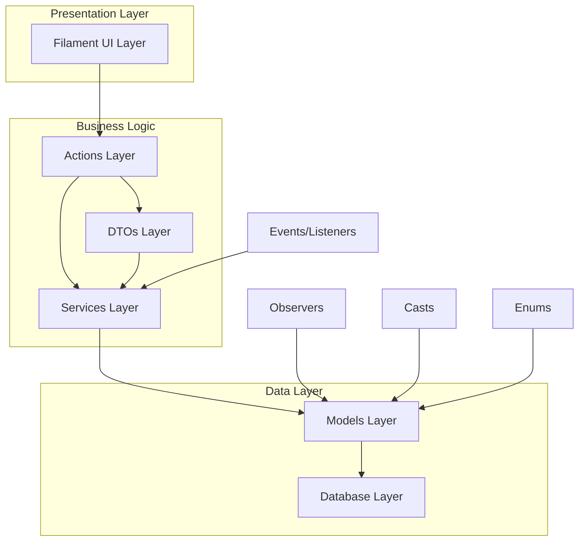
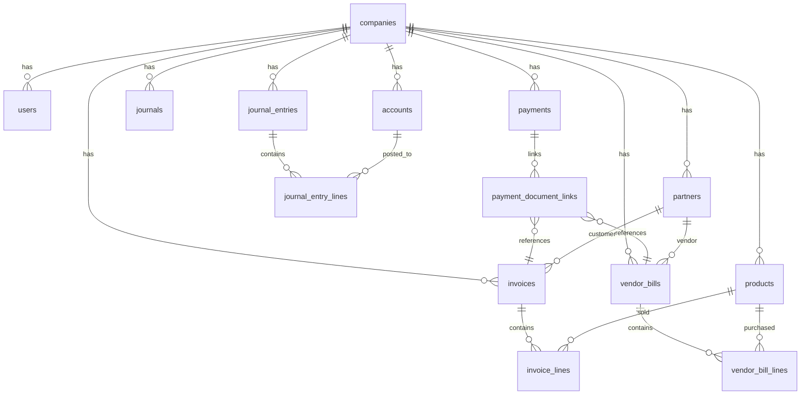
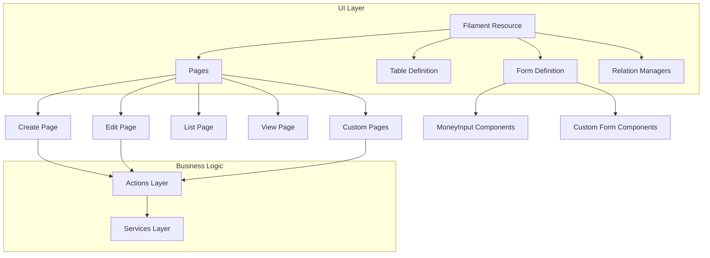
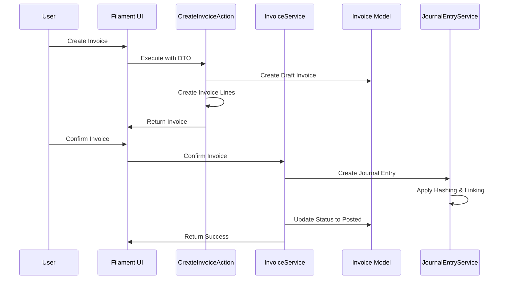

# Laravel Accounting Application - Complete Technical Documentation

## Table of Contents

1. [Application Overview & Purpose](#1-application-overview--purpose)
2. [Technology Stack & Dependencies](#2-technology-stack--dependencies)
3. [System Architecture & Design Patterns](#3-system-architecture--design-patterns)
4. [Database Design & Models](#4-database-design--models)
5. [Business Logic Layer](#5-business-logic-layer)
6. [User Interface Layer (Filament)](#6-user-interface-layer-filament)
7. [Testing Strategy & Patterns](#7-testing-strategy--patterns)
8. [Key Accounting Workflows](#8-key-accounting-workflows)
9. [Security & Audit Features](#9-security--audit-features)
10. [Development Patterns & Best Practices](#10-development-patterns--best-practices)
11. [Internationalization & Localization](#11-internationalization--localization)
12. [Performance & Scalability](#12-performance--scalability)

---

## 1. Application Overview & Purpose

This is a **headless accounting application** specifically designed for the Iraqi market, a robust accounting principles but adapted for environments without widespread digital banking infrastructure. The application prioritizes **manual data entry**, **immutability**, and **complete auditability** of financial records.

### Core Philosophy
- **Manual Data Entry First**: No external banking integrations (Stripe, PayPal, etc.)
- **Immutability is Law**: Posted financial records cannot be edited or deleted, only reversed
- **Headless Architecture**: Backend-only focus with solid business logic
- **Business Logic-Focused TDD**: Comprehensive testing with Pest framework

### Key Features
- **Multi-Company Support**: Complete data isolation per company
- **Double-Entry Accounting**: Full compliance with accounting principles
- **Cryptographic Audit Trail**: SHA-256 hashing with blockchain-like linking
- **Period Locking**: Prevent backdated entries after period close
- **Multi-Currency Support**: Handle multiple currencies with exchange rates
- **Asset Management**: Fixed asset tracking with depreciation
- **Inventory Management**: Stock tracking with valuation methods
- **Bank Reconciliation**: Match bank statements with system transactions

---

## 2. Technology Stack & Dependencies

### Core Framework
- **Laravel 12** with PHP 8.2+
- **Filament 3.3** for admin interface
- **Pest 3.8** for testing framework

### Key Dependencies
- **Brick\Money 0.10.1** - Precise financial calculations
- **Spatie Laravel Translatable** - Multi-language support
- **DomPDF** - PDF document generation
- **Filament Developer Logins** - Development utilities
- **Filament Environment Indicator** - Environment awareness

### Development Tools
- **Laravel IDE Helper** - Enhanced IDE support
- **Laravel Pint** - Code formatting
- **Laravel Pail** - Log monitoring
- **Pest Livewire Plugin** - Filament testing

---

## 3. System Architecture & Design Patterns

### Layered Architecture



### Design Patterns Implemented

1. **Command Pattern**: Actions with single `execute()` methods
2. **Data Transfer Object (DTO)**: Type-safe data contracts
3. **Observer Pattern**: Model observers for side effects
4. **Service Layer Pattern**: Business logic orchestration
5. **Money Object Pattern**: Precise financial calculations
6. **Repository Pattern**: Through Eloquent models
7. **Factory Pattern**: Model factories for testing

### Architecture Principles

- **Single Responsibility**: Each class has one clear purpose
- **Dependency Injection**: Constructor injection throughout
- **Interface Segregation**: Small, focused interfaces
- **Open/Closed Principle**: Extensible without modification
- **Database Transactions**: Atomic operations for data integrity

---

## 4. Database Design & Models

### Database Schema Overview

The application uses **38+ tables** organized around double-entry accounting principles:



### Core Models & Relationships

#### Financial Core Models

**Company Model** - Multi-company root entity:
```php
class Company extends Model
{
    protected $fillable = [
        'name', 'address', 'tax_id', 'currency_id', 'fiscal_country',
        'parent_company_id', 'default_accounts_payable_id',
        'default_sales_journal_id', 'default_bank_journal_id',
        // ... other default account configurations
    ];

    public function currency(): BelongsTo
    {
        return $this->belongsTo(Currency::class);
    }

    public function journals(): HasMany
    {
        return $this->hasMany(Journal::class);
    }
}
```

**JournalEntry Model** - Immutable financial transactions:
```php
class JournalEntry extends Model
{
    protected $fillable = [
        'company_id', 'journal_id', 'entry_date', 'reference',
        'description', 'total_debit', 'total_credit', 'is_posted',
        'hash', 'previous_hash', 'created_by_user_id'
    ];

    protected $casts = [
        'entry_date' => 'date',
        'total_debit' => MoneyCast::class,
        'total_credit' => MoneyCast::class,
        'is_posted' => 'boolean',
        'state' => JournalEntryState::class,
    ];
}
```

#### Business Document Models

**Invoice Model** - Customer sales documents:
```php
class Invoice extends Model
{
    use HasPaymentState;

    protected $fillable = [
        'company_id', 'customer_id', 'currency_id', 'invoice_number',
        'invoice_date', 'due_date', 'status', 'total_amount', 'total_tax'
    ];

    protected $casts = [
        'status' => InvoiceStatus::class,
        'total_amount' => MoneyCast::class,
        'total_tax' => MoneyCast::class,
        'reset_to_draft_log' => 'json',
    ];
}
```

### Database Table Categories

#### Core Financial Tables
- `companies` - Multi-company root entity
- `accounts` - Chart of accounts with AccountType enum
- `journals` - Transaction categorization (Sales, Purchase, Bank, etc.)
- `journal_entries` - Immutable financial transactions with cryptographic hashing
- `journal_entry_lines` - Double-entry debit/credit lines

#### Business Document Tables
- `invoices` / `invoice_lines` - Customer sales
- `vendor_bills` / `vendor_bill_lines` - Vendor purchases  
- `payments` / `payment_document_links` - Payment processing
- `adjustment_documents` - Credit/debit notes for corrections

#### Supporting Tables
- `partners` - Customers/vendors with soft deletes
- `products` - Items with inventory valuation methods
- `currencies` - Multi-currency support
- `taxes` - Tax calculations and mappings
- `assets` / `depreciation_entries` - Fixed asset management

#### Advanced Features
- `bank_statements` / `bank_statement_lines` - Bank reconciliation
- `stock_locations` / `stock_moves` - Inventory management
- `analytic_accounts` - Cost center tracking
- `budgets` / `budget_lines` - Budget planning
- `lock_dates` - Period locking for compliance

### Key Database Features

1. **Multi-Company Architecture**: All financial data scoped by `company_id`
2. **Immutability Enforcement**: Posted records protected by observers
3. **Cryptographic Hashing**: SHA-256 hashing with blockchain-like linking
4. **Soft Deletes**: Applied to non-financial records (partners, products)
5. **Audit Trails**: Complete logging in `audit_logs` table
6. **Period Locking**: `lock_dates` table prevents backdated entries

---

## 5. Business Logic Layer

### Actions Layer (50+ Classes)

Actions implement the **Command Pattern** with domain organization:

**Directory Structure:**
```
app/Actions/
├── Accounting/     # Journal entries, bank statements
├── Sales/          # Invoices, credit notes
├── Purchases/      # Vendor bills, debit notes
├── Payments/       # Payment processing
├── Assets/         # Asset management, depreciation
├── Inventory/      # Stock moves, adjustments
└── Adjustments/    # Document adjustments
```

**Example Action Implementation:**
```php
class CreateVendorBillAction
{
    public function __construct(
        protected LockDateService $lockDateService,
        protected CreateVendorBillLineAction $createVendorBillLineAction
    ) {}

    public function execute(CreateVendorBillDTO $createVendorBillDTO): VendorBill
    {
        $this->lockDateService->enforce(/* ... */);

        return DB::transaction(function () use ($createVendorBillDTO) {
            $vendorBill = VendorBill::create([/* ... */]);
            
            foreach ($createVendorBillDTO->lines as $lineDTO) {
                $this->createVendorBillLineAction->execute($vendorBill, $lineDTO);
            }
            
            return $vendorBill->fresh('lines');
        });
    }
}
```

### Services Layer (15+ Classes)

Services orchestrate complex business workflows:

- **JournalEntryService**: Handles posting, hashing, immutability
- **InvoiceService**: Invoice lifecycle management
- **PaymentService**: Payment processing and allocation
- **BankReconciliationService**: Transaction matching
- **LockDateService**: Period locking enforcement
- **InventoryValuationService**: Stock costing methods
- **AssetService**: Fixed asset management

### DTOs Layer (40+ Classes)

Type-safe data contracts with Money object integration:

**Directory Structure:**
```
app/DataTransferObjects/
├── Accounting/     # Journal entry DTOs
├── Sales/          # Invoice DTOs
├── Purchases/      # Vendor bill DTOs
├── Payments/       # Payment DTOs
├── Assets/         # Asset DTOs
├── Inventory/      # Stock move DTOs
└── Adjustments/    # Adjustment DTOs
```

**Example DTO Implementation:**
```php
readonly class CreateInvoiceDTO
{
    public function __construct(
        public int $company_id,
        public int $customer_id,
        public int $currency_id,
        public Carbon $invoice_date,
        public Carbon $due_date,
        public array $lines, // Array of CreateInvoiceLineDTO
        public int $created_by_user_id,
    ) {}
}
```

---

## 6. User Interface Layer (Filament)

### Resource Architecture

18 main Filament resources with clean separation:



### Key Filament Resources

1. **InvoiceResource** - Customer invoice management
2. **VendorBillResource** - Vendor bill processing
3. **PaymentResource** - Payment handling
4. **JournalEntryResource** - Manual journal entries
5. **BankStatementResource** - Bank reconciliation
6. **PartnerResource** - Customer/vendor management
7. **ProductResource** - Product catalog
8. **AccountResource** - Chart of accounts
9. **AssetResource** - Fixed asset management

### Custom Filament Components

**MoneyInput Component** - Handles Brick\Money objects:
```php
class InvoiceResource extends Resource
{
    public static function form(Form $form): Form
    {
        return $form->schema([
            Section::make()->schema([
                // Header fields
                Forms\Components\Select::make('customer_id'),
                Forms\Components\DatePicker::make('invoice_date'),
                
                // Dynamic line items with MoneyInput
                Repeater::make('lines')->schema([
                    MoneyInput::make('unit_price')
                        ->currencyField('../../currency_id'),
                ])->live()->afterStateUpdated(fn($state, $set) => 
                    static::updateTotals($state, $set)
                ),
            ]),
        ]);
    }
}
```

### Custom Components

1. **MoneyInput**: Handles Brick\Money objects with currency awareness
2. **MoneyColumn**: Displays formatted monetary values in tables
3. **Custom Livewire Components**: For complex interactions (bank reconciliation)
4. **Relation Managers**: Manage related entities efficiently

---

## 7. Testing Strategy & Patterns

### Testing Architecture

**Pest Configuration:**
```php
pest()->extend(Tests\TestCase::class)
    ->use(Illuminate\Foundation\Testing\RefreshDatabase::class)
    ->in('Feature');
```

### Testing Patterns

1. **Feature Tests**: End-to-end business logic testing
2. **Unit Tests**: Isolated service and action testing
3. **Filament Tests**: UI and integration testing
4. **Money Object Testing**: Precise financial calculation validation

**Example Action Test:**
```php
it('creates a balanced journal entry with correct money handling', function () {
    // Arrange
    $journalEntryDTO = new CreateJournalEntryDTO(/* ... */);
    
    // Act
    $action = app(CreateJournalEntryAction::class);
    $journalEntry = $action->execute($journalEntryDTO);
    
    // Assert
    $this->assertDatabaseHas('journal_entry_lines', [
        'debit' => 150750, // Minor units (150.75 * 1000 for IQD)
    ]);
});
```

### Test Organization

- **Feature Tests**: `/tests/Feature/` - Business workflow testing
- **Unit Tests**: `/tests/Unit/` - Isolated component testing
- **Traits**: `WithConfiguredCompany`, `MocksTime` for consistent setup
- **Factories**: Comprehensive model factories for test data

### Testing Best Practices

1. **RefreshDatabase**: Clean slate for each test
2. **Model Factories**: Consistent test data generation
3. **Money Object Testing**: Proper handling of financial precision
4. **Filament Testing**: UI interaction validation
5. **Service Testing**: Business logic verification

---

## 8. Key Accounting Workflows

### Sales Process Flow



### Purchase Process Flow

1. **Draft Creation**: Create vendor bill in draft status
2. **Line Item Addition**: Add products/services with quantities and prices
3. **Tax Calculation**: Apply appropriate taxes based on fiscal position
4. **Confirmation**: Post the bill and generate journal entry
5. **Payment Processing**: Record payments against the bill
6. **Reconciliation**: Match payments with bank statements

### Bank Reconciliation Process

**Livewire Component for Reconciliation:**
```php
class BankReconciliationMatcher extends Component
{
    public function reconcile()
    {
        if (!$this->summary()['isBalanced']) {
            // Show error notification
            return;
        }

        app(BankReconciliationService::class)->reconcileMultiple(
            $this->selectedBankLines,
            $this->selectedPayments,
            Auth::user()
        );
        
        // Clear selections and notify success
    }
}
```

### Asset Management Workflow

1. **Asset Acquisition**: Record asset purchase with journal entry
2. **Depreciation Setup**: Configure depreciation method and schedule
3. **Periodic Depreciation**: Generate monthly/yearly depreciation entries
4. **Asset Disposal**: Record asset sale or disposal with gain/loss calculation

---

## 9. Security & Audit Features

### Immutability Enforcement

1. **Model-Level Protection**: RuntimeException for posted record modifications
2. **Observer-Based Hashing**: SHA-256 with blockchain-like linking
3. **Period Locking**: Prevent backdated entries after period close
4. **Audit Logging**: Complete user action tracking

### Cryptographic Features

**Journal Entry Hashing:**
```php
// In JournalEntryObserver
public function creating(JournalEntry $journalEntry): void
{
    if ($journalEntry->is_posted) {
        $this->applyHashingAndLinking($journalEntry);
    }
}

private function applyHashingAndLinking(JournalEntry $journalEntry): void
{
    // Generate SHA-256 hash of essential data
    $hashData = /* essential fields */;
    $journalEntry->hash = hash('sha256', $hashData);
    
    // Link to previous entry's hash
    $previousEntry = /* get last entry */;
    $journalEntry->previous_hash = $previousEntry?->hash;
}
```

### Audit Trail Features

1. **Complete Action Logging**: Every user action recorded
2. **IP Address Tracking**: Security monitoring
3. **Before/After Values**: Change tracking
4. **Tamper Detection**: Hash chain verification
5. **User Attribution**: Full user accountability

---

## 10. Development Patterns & Best Practices

### Money Object Integration

The application uses **Brick\Money** throughout for precise financial calculations:

**Money Cast Implementation:**
```php
class MoneyCast implements CastsAttributes
{
    public function set($model, string $key, $value, array $attributes): int
    {
        $currency = $this->resolveCurrency($model);
        
        if ($value instanceof Money) {
            return $value->getMinorAmount()->toInt();
        }
        
        return Money::of($value, $currency->code)
            ->getMinorAmount()->toInt();
    }
}
```

### Enum-Based Type Safety

All status fields use enums for type safety:

**Invoice Status Enum:**
```php
enum InvoiceStatus: string
{
    case Draft = 'draft';
    case Posted = 'posted';
    case Paid = 'paid';
    case Cancelled = 'cancelled';

    public function label(): string
    {
        return __('enums.invoice_status.' . $this->value);
    }
}
```

### Observer Pattern Implementation

Observers handle side effects only, never business logic:

**VendorBillLine Observer:**
```php
class VendorBillLineObserver
{
    public function created(VendorBillLine $line): void
    {
        // Side effect: Update parent totals
        $this->updateVendorBillTotals($line->vendorBill);
    }
    
    // Never put business logic calculations here
}
```

### Best Practices Summary

1. **Separation of Concerns**: Clear layer boundaries
2. **Type Safety**: Enums and DTOs throughout
3. **Financial Precision**: Money objects for all calculations
4. **Immutability**: Posted records cannot be modified
5. **Comprehensive Testing**: Full test coverage
6. **Audit Compliance**: Complete audit trails
7. **Multi-Company Support**: Proper data isolation

---

## 11. Internationalization & Localization

The application supports multiple languages through:

1. **Spatie Laravel Translatable**: Model field translations
2. **Laravel Translation System**: UI text translations
3. **Enum Translations**: Status and type translations
4. **Currency Support**: Multi-currency with exchange rates

### Translation Implementation

**Model Translations:**
```php
class Account extends Model
{
    use HasTranslations;
    
    public array $translatable = ['name'];
}
```

**Enum Translations:**
```php
public function label(): string
{
    return __('enums.invoice_status.' . $this->value);
}
```

---

## 12. Performance & Scalability

### Optimization Strategies

1. **Eager Loading**: Prevent N+1 queries in relationships
2. **Database Indexing**: Proper indexing on foreign keys and search fields
3. **Query Optimization**: Efficient Eloquent queries
4. **Caching**: Strategic caching for lookup data
5. **Queue Processing**: Background jobs for heavy operations

### Database Optimization

- **Foreign Key Constraints**: Ensure referential integrity
- **Composite Indexes**: Multi-column indexes for complex queries
- **Partial Indexes**: Conditional indexes for specific use cases
- **Query Analysis**: Regular performance monitoring

---

## Conclusion

This Laravel accounting application represents a sophisticated, enterprise-grade financial system built with modern software engineering principles. It successfully combines the rigor of traditional accounting systems with the flexibility and maintainability of modern Laravel architecture.

### Key Strengths

1. **Robust Architecture**: Layered design with clear separation of concerns
2. **Financial Precision**: Brick\Money integration for accurate calculations
3. **Immutable Audit Trail**: Cryptographic hashing and blockchain-like linking
4. **Comprehensive Testing**: Full test coverage with Pest framework
5. **Type Safety**: Extensive use of DTOs and enums
6. **Multi-Company Support**: Complete data isolation and configuration
7. **Compliance Ready**: Period locking and audit features

This codebase demonstrates excellent separation of concerns, type safety through DTOs and enums, and a testing strategy that ensures reliability across all layers of the application, making it a robust foundation for accounting operations where data integrity and audit compliance are paramount.
