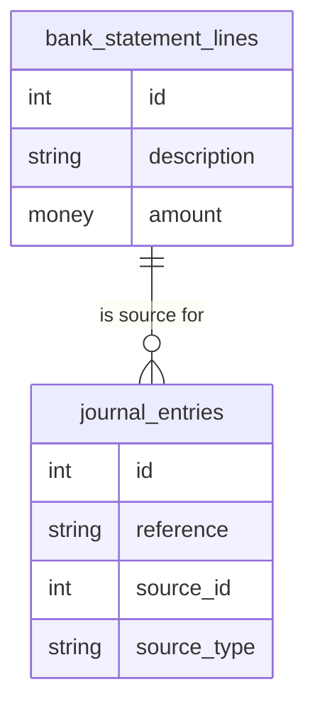
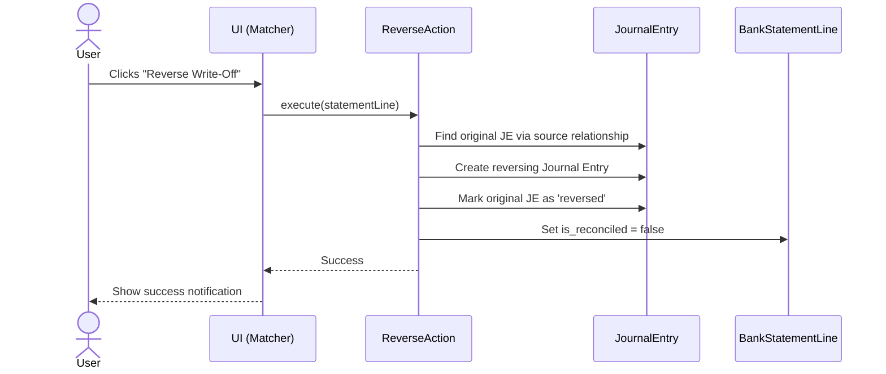

# Plan: Auditable Bank Reconciliation Write-Offs

## 1. Overview

This document outlines the plan to enhance the bank reconciliation write-off feature to make it fully auditable, reversible, and robust, aligning it with the project's core principles of immutability and data integrity.

## 2. Gap Analysis: The Missing Pieces

The current implementation has three main gaps:

1.  **Critical Audit Trail Gap:** There is no direct, database-level link between a `BankStatementLine` and the `JournalEntry` that writes it off. The existing `source` polymorphic relationship is not being utilized.
2.  **No Reversal Mechanism:** There is no defined process to reverse a write-off, which is essential in an immutable accounting system.
3.  **Inadequate Test Coverage:** Existing tests only cover the "happy path" and do not verify the audit trail link or test failure scenarios.

---

## 3. The Plan: Achieving a Truly Auditable Feature

### Part 1: Implementation Plan

#### A. Strengthen the Audit Trail (Highest Priority)

*   **Objective:** Use the existing `source` polymorphic relationship on the `journal_entries` table to create an unbreakable link to the `BankStatementLine`.
*   **File to Modify:** `app/Actions/Accounting/CreateJournalEntryForStatementLineAction.php`
*   **Change:** When building the `CreateJournalEntryDTO`, populate a new `source_document` property with the `$line` object. The `CreateJournalEntryAction` will then need to be updated to handle this DTO property and set the `source` relationship on the `JournalEntry` model.

#### B. Implement the Reversal Mechanism

*   **Objective:** Create a new workflow for reversing a write-off.
*   **New Action:** Create `app/Actions/Accounting/ReverseJournalEntryForStatementLineAction.php`. This action will find the original journal entry, create a reversing entry, mark the original as 'reversed', and set the bank statement line's `is_reconciled` flag to `false`.
*   **New UI:** Add a "Reverse Write-Off" button in the UI that triggers this new action.

#### C. Refine Logic Ownership

*   **Objective:** Remove redundant code to clarify responsibility.
*   **File to Modify:** `app/Services/BankReconciliationService.php`
*   **Change:** In the `createWriteOff` method, remove the line `$line->update(['is_reconciled' => true]);`. The `CreateJournalEntryForStatementLineAction` is already responsible for this.

### Part 2: Testing Plan

1.  **Create a Dedicated Action Test:**
    *   **New File:** `tests/Feature/Actions/Accounting/CreateJournalEntryForStatementLineActionTest.php`
    *   **Key Assertions:**
        *   Verify `source_id` and `source_type` on the `JournalEntry` are correct.
        *   Test with multiple currencies (IQD, USD, EUR).
        *   Test failure cases (e.g., misconfigured journal).

2.  **Create a Reversal Action Test:**
    *   **New File:** `tests/Feature/Actions/Accounting/ReverseJournalEntryForStatementLineActionTest.php`
    *   **Key Assertions:**
        *   Verify the original journal entry's `state` is updated to `reversed`.
        *   Verify a new, correct, reversing journal entry is created.
        *   Verify the `BankStatementLine.is_reconciled` is set to `false`.
