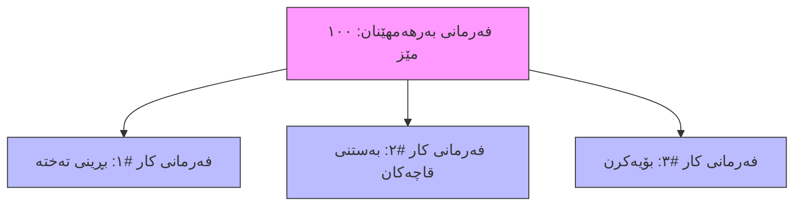

# تێگەیشتن لە فەرمانەکانی کار: هەنگاوەکانی بەرهەمهێنان

ئەم ڕێبەرە ڕوونی دەکاتەوە کە فەرمانەکانی کار چین و چۆن لە پرۆسەی بەرهەمهێنانی تۆدا جێگەیان دەبێتەوە. جا تۆ بەڕێوەبەری بەرهەمهێنان بیت یان کارمەندی ناو کارگە، ئەم ڕێبەرە یارمەتیت دەدات بۆ بەدواداچوونی کارەکانت.

---

## فەرمانی کار چییە؟

بیر لە **فەرمانی بەرهەمهێنان** بکەرەوە وەک ڕەچەتەیەکی تەواو (بۆ نموونە، "دروستکردنی کێک"). **فەرمانی کار** تاکە هەنگاوێکە لەو ڕەچەتەیە (بۆ نموونە، "تێکەڵکردنی پێکهاتەکان"، "برژاندن لە فڕن"، "ڕازاندنەوە").

کاتێک فەرمانی بەرهەمهێنان پشتڕاست دەکەیتەوە، سیستەمەکە دابەشی دەکات بۆ فەرمانی کاری تاکەکەسی. هەر فەرمانێکی کار نوێنەرایەتی کردارێکی دیاریکراو دەکات کە پێویستە لە **ناوەندێکی کاری** دیاریکراودا ئەنجام بدرێت.

**بۆچی ئەمە گرنگە؟**
1.  **کۆنترۆڵی ورد**: بەدواداچوون بۆ پێشکەوتنی کار هەنگاو بە هەنگاو.
2.  **بەڕێوەبردنی سەرچاوەکان**: خشتەدانان بۆ ئامێر یان وێستگە دیاریکراوەکان (ناوەندەکانی کار).
3.  **ووردی خەرجی**: تۆمارکردنی کاتی ڕاستەقینەی بەسەرچوو بۆ هەر کردارێک بۆ هەژمارکردنی وردی تێچووی کار و خەرجییە گشتییەکان.

---

## پەیوەندی بە فەرمانەکانی بەرهەمهێنانەوە

فەرمانی بەرهەمهێنان (MO) بەڵگەنامە سەرەکییەکەیە. پێت دەڵێت *چی* دروست بکەیت و *کەی*. فەرمانەکانی کار (WO) لقەکانن؛ ئەوان پێت دەڵێن *چۆن* دروستی بکەیت، هەنگاو بە هەنگاو.



- **یەک فەرمانی بەرهەمهێنان** چەندین **فەرمانی کار** دروست دەکات.
- بەزۆری پێویستە فەرمانەکانی کار بە ڕیزبەندی تەواو بکەیت (هەنگاو ١ ← هەنگاو ٢ ← هەنگاو ٣).

---

## سووڕی ژیانی فەرمانی کار

فەرمانی کار بە سووڕێکی ژیانی دیاریکراودا تێدەپەڕێت کاتێک لە ناو کارگەکەتدا دەجوڵێت:

```
چاوەڕوان ──▶ ئامادە ──▶ لە کارکردندا ──▶ تەواو
   ⏳         ✅           ⚙️           🎉
```

### ⏳ چاوەڕوان (Pending)
- فەرمانی کار دروستکراوە بەڵام هێشتا ناتوانرێت دەست پێ بکرێت.
- بەزۆری چاوەڕێی تەواوکردنی هەنگاوی پێشوو دەکات (بۆ نموونە، ناتوانیت "بۆیە" بکەیت پێش ئەوەی "بەستن" تەواو بکەیت).

### ✅ ئامادە (Ready)
- هەموو مەرجە پێشوەختەکان جێبەجێ کراون.
- کەرەستەی خام بەردەستە (ئەگەر هەبێت).
- ناوەندی کار ئامادەیە بۆ وەرگرتنی ئەم کارە.

### ⚙️ لە کارکردندا (In Progress)
- کار دەستی پێکردووە.
- کاتژمێرەکە کار دەکات (تۆمارکردنی ماوەی ڕاستەقینە).
- پێکهاتەکان بەکاردەهێنرێن.

### 🎉 تەواو (Done)
- کردارەکە تەواو بووە.
- بەرهەمەکە ئامادەیە بۆ هەنگاوی داهاتوو یان کۆگاکردنی کۆتایی.
- تێچوو ڕاستەقینەکان تۆمار دەکرێن.

> [!NOTE]
> هەروەها دەتوانیت فەرمانی کار **هەڵبوەشێنیتەوە** ئەگەر فەرمانی بەرهەمهێنانەکە هەڵوەشایەوە یان پلانەکە گۆڕدرا.

---

## دیاریکردن بۆ ناوەندەکانی کار

هەر فەرمانێکی کار بۆ **ناوەندێکی کار** دیاری دەکرێت. ئەمە شوێن یان ئامێرێکی دیاریکراوە کە کارەکەی تێدا ئەنجام دەدرێت (بۆ نموونە، "هێڵی بەستنی ١"، "ئامێری دڕێل A").

- **پلاندانانی توانایی**: سیستەمەکە خشتەی فەرمانەکانی کار دادەنێت بەپێی بەردەستبوونی ناوەندی کار.
- **تێچوو**: تێچووی فەرمانی کار زۆرجار بەپێی نرخی کاتژمێری ناوەندی کار هەژمار دەکرێت.

> [!TIP]
> سەیری ڕێبەری [تێگەیشتن لە ناوەندەکانی کار](understanding-work-centers.md) بکە بۆ وردەکاری زیاتر.

---

## بەدواداچوونی کات

وردبینی کلیلی تێچووە. هەر فەرمانێکی کار دوو جۆر کات تۆمار دەکات:

| جۆری کات | وەسف | بۆچی گرنگە |
|-----------|-------------|----------------|
| **ماوەی پلان بۆ دانراو** | چەند کاتمان پێوەیە *پێشبینی دەکەین*. لە لیستی کەرەستەکانەوە (BOM). | بۆ خشتەدانان و تێچوو خەمڵێنراو بەکاردێت. |
| **ماوەی ڕاستەقینە** | لە ڕاستیدا چەندی خایاند. لەلایەن کارمەندەوە تۆمار دەکرێت. | بۆ تێچوو ڕاستەقینەکان و ڕاپۆرتی کارایی بەکاردێت. |

**چۆنێتی تۆمارکردنی کات:**
1.  کلیک لە **دەستپێکردن** بکە کاتێک دەست بە کار دەکەیت.
2.  کلیک لە **وەستان** بکە ئەگەر پشوویەک وەردەگریت.
3.  کلیک لە **تەواو** بکە کاتێک ئەرکەکە کۆتایی هات.

سیستەمەکە بە شێوەیەکی خۆکار `ماوەی ڕاستەقینە` هەژمار دەکات.

---

## بەکارهێنانی پێکهاتەکان

هەندێک فەرمانی کار پێکهاتەی دیاریکراو بەکاردەهێنن. بۆ نموونە، هەنگاوی "بەستن" ڕەنگە "بورغی" و "تەختە" بەکاربهێنێت.

- **بەکارهێنانی دەستی**: تۆ بە وردی ئەوەی بەکارت هێناوە تۆماری دەکەیت.
- **بەکارهێنانی خۆکار (Backflushing)**: سیستەمەکە بە شێوەیەکی خۆکار بڕی چاوەڕوانکراو "بەکار دەهێنێت" کاتێک کلیک لە تەواو دەکەیت.

دڵنیابە لەوەی بەکارهێنان بە وردی تۆمار دەکەیت بۆ ئەوەی ئاستی کۆگاکەت بە ڕاستی بمێنێتەوە.

---

## باشترین پراکتیزەکان

### 📅 ڕیزبەندی گرنگە
- پەیڕەوی ئەو ڕیزبەندییە بکە کە لە فەرمانی بەرهەمهێناندا دیاری کراوە. پەڕاندنی هەنگاوەکان دەبێتە هۆی کێشەی کوالیتی یان سەرلێشێواوی.

### ⏱️ ڕاستگۆ بە لەگەڵ کات
- کاتی دەستپێکردن و وەستانی ڕاستەقینە تۆمار بکە. ئەگەر کارێک کاتی زیاتری ویست، پێویستە بزانین بۆچی (تێکچوونی ئامێر؟ کەرەستەی خراپ؟) بۆ باشترکردنی پلاندانانی داهاتوو.

### 🧹 ناوەندەکانی کار بە خاوێنی ڕابگرە
- فەرمانی کار تەنها کاتێک بە "تەواو" نیشانە بکە کە کەلوپەلەکان گواسترانەوە بۆ وێستگەی داهاتوو. ئەمە خشتەکە بە وردی دەهێڵێتەوە.

---

## چارەسەرکردنی کێشەکان

### پرسیار: بۆچی فەرمانی کارەکەم لە "چاوەڕوان" (Pending) ماوەتەوە؟
**وەڵام**: ئەمە بەزۆری واتە هەنگاوی پێشوو هێشتا تەواو نەبووە. سەیری فەرمانی بەرهەمهێنان بکە بۆ بینینی دۆخی فەرمانەکانی کاری پێشوو.

### پرسیار: ئایا دەتوانم ناوەندی کاری دیاریکراو بگۆڕم؟
**وەڵام**: بەڵێ، ئەگەر فەرمانی کارەکە هێشتا دەستی پێ نەکردبێت. ئەمە بەسوودە بۆ هاوسەنگکردنی بار ئەگەر ئامێرێک سەرقاڵ بێت.

### پرسیار: بۆچی "تێچووی ڕاستەقینە"م لە چاوەڕوانکراو بەرزترە؟
**وەڵام**: سەیری **ماوەی ڕاستەقینە** بکە. ئایا کارمەندەکە لەبیری کردووە کاتژمێرەکە بوەستێنێت؟ یان ئایا ئامێرەکە هێواشتر کاری کردووە لە **ماوەی پلان بۆ دانراو**؟

---

## بەڵگەنامە پەیوەندیدارەکان
- [تێگەیشتن لە فەرمانەکانی بەرهەمهێنان](understanding-manufacturing-orders.md)
- [تێگەیشتن لە ناوەندەکانی کار](understanding-work-centers.md)
